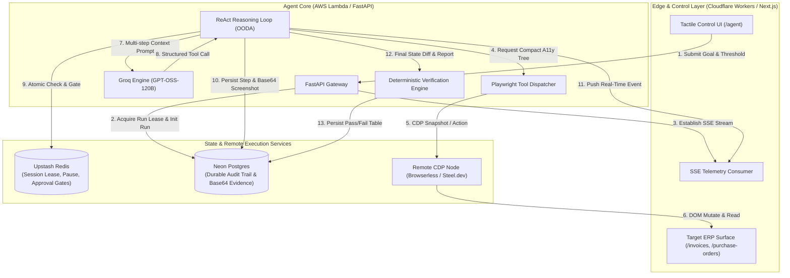
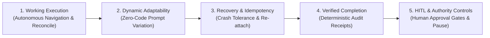
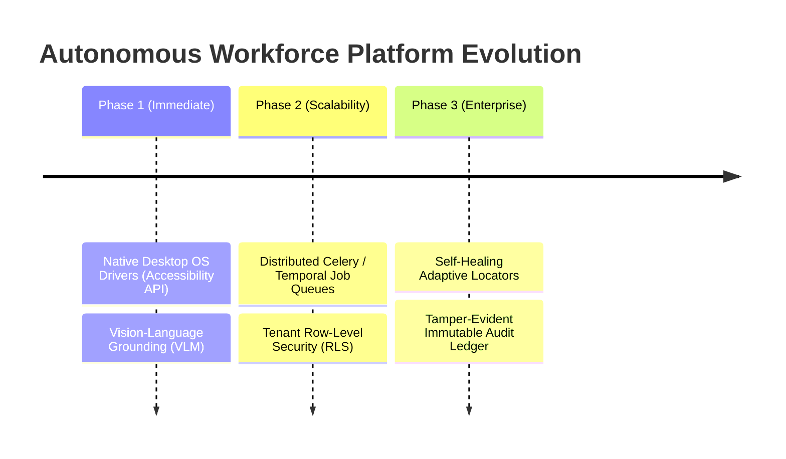

# Engineering Note: Autonomous Browser Agent for ERP Operations

**Author / Candidate Submission**  
**Role:** Senior Autonomous Systems / AI Engineer  
**Repository:** [hulchul-assignment](https://github.com/kaiizer777/hulchul-assignment)  
**Live Stack:** FastAPI (AWS Lambda) · Next.js 16 App Router (Cloudflare Workers) · Playwright Remote CDP · Neon Serverless PostgreSQL · Upstash Redis · Groq (`openai/gpt-oss-120b`)

---

## 1. Executive Summary & System Architecture

Modern enterprise enterprise resource planning (ERP) systems (e.g., SAP S/4HANA, NetSuite, Coupa) often lack comprehensive, reliable APIs for edge reconciliation tasks or legacy third-party interfaces. Automating these workflows requires an autonomous agent capable of operating human-facing web interfaces with the same precision, caution, and auditability as a senior accounting operator.

This system implements an end-to-end autonomous browser agent designed to reconcile vendor invoices against purchase orders within an ERP. The architecture decouples the autonomous intelligence engine from browser execution and interface rendering, achieving sub-second operational latency, zero local browser container bloat, and durable multi-tier auditability.

### Architectural Principles & Design Choices

1. **Decoupled Operator Model**:
   - **Frontend / Target ERP**: Next.js 16 (Turbopack, TypeScript, Tailwind CSS) deployed to Cloudflare Workers via `@opennextjs/cloudflare`. Houses both the target enterprise surface (`/invoices`, `/purchase-orders`, `/vendors`) and the operator workstation (`/agent`).
   - **Backend Orchestrator**: Python 3.12 FastAPI service packaged into an ultra-slim container (~80MB) and deployed to AWS Lambda using the AWS Lambda Web Adapter.

2. **Stateless Remote CDP Architecture**:
   - Running full headless Chromium binaries inside serverless container environments produces cold starts of 8–15 seconds, memory spikes exceeding 2GB RAM, and container bloat (>800MB).
   - We utilize Playwright over remote Chrome DevTools Protocol (CDP) WebSocket connections (`Browserless` / `Steel.dev`). The agent connects ephemerally per task, preserving instant Lambda cold starts (~400ms) with a memory footprint below 150MB.

3. **Multi-Tier State & Verification**:
   - **Fast-Path State (Upstash Redis)**: Sub-millisecond atomic polling for execution leases, human pause flags, and approval gate nonces.
   - **Durable Audit Trail (Neon PostgreSQL)**: ACID transaction logs storing every reasoning step, tool call, HTTP payload, execution status, and base64 failure screenshot.
   - **Deterministic Post-Execution Verification**: Independent SQL query engine validating ERP state mutations against predefined ground truth before certifying run completion.

---

## 2. Assignment Alignment: The 5 Core Pillars

### Pillar 1: Working Execution
- **Input**: High-level plain-English goal (e.g., *"Process all pending invoices for Acme Corp and reconcile against purchase orders"*).
- **Autonomous Navigation**: The agent inspects the accessibility tree (`read_page()`), navigates to `/invoices`, extracts pending records, verifies matching POs at `/purchase-orders`, cross-checks vendor master data at `/vendors`, and inputs reconciled records via `/invoices/new`.
- **Evidence Generation**: Every state transition generates a timestamped step record with structured inputs, outputs, and DOM screenshots for decision points and failures.

### Pillar 2: Dynamic Adaptability
The agent executes dynamic operational variants purely from prompt interpretation without code modifications or configuration re-deploys:
- **Vendor-Specific Scope**: `"Process only invoices from Vendor Initech and flag discrepancies"` $\rightarrow$ Agent filters DOM entities and ignores unrelated vendor rows.
- **Custom Authority Thresholds**: `"Hold anything over ₹25,000 for executive approval"` $\rightarrow$ Agent dynamically sets its internal evaluation threshold and initiates approval gates when encountering matching sums.
- **Novel Data Distributions**: Ingestion of arbitrary invoice batches with variable row counts, mismatched line items, or missing PO associations without syntax or locator breakages.

### Pillar 3: Recovery & Idempotency
- **Strict Pre-Mutation Idempotency**: Prior to executing any form submission or entity creation, the agent must invoke `check_exists(entity_type, identifier)`. If a duplicate invoice or active transaction exists, the step is safely skipped.
- **Crash Recovery & Step Resumption**: If an unhandled network partition, CDP WebSocket drop, or ERP 500 internal server error occurs (e.g., simulated via `SIMULATE_FAILURE_AFTER`):
  1. The failure is caught, snapshotted, and recorded as `failed` in `agent_steps`.
  2. The recovery orchestrator reads the last successful step index from Neon PostgreSQL (`SELECT MAX(step_index) FROM agent_steps WHERE run_id = :id AND status = 'success'`).
  3. The agent re-establishes its CDP session and resumes execution at `step_index + 1` without duplicating previous entries.

### Pillar 4: Verified Completion
- **Independent State Inspection**: Upon ReAct termination, the system executes an automated reconciliation sweep querying raw database records directly.
- **Verification Diff**: Compares actual ERP invoice statuses (`approved`, `flagged`, `rejected`, `skipped`) against deterministic validation rules (e.g., amount match $\le 10\%$, PO existence).
- **Audit Receipt**: Generates a cryptographically verifiable tabular summary highlighting exact matches ($\checkmark$), rule breaches ($\times$), and base64 visual evidence for audit readiness.

### Pillar 5: Human-in-the-Loop (HITL) & Authority Controls
- **Granular Execution Authority**: Financial controls enforce that any transaction exceeding the configured threshold (default ₹50,000 or dynamically extracted from the goal) cannot be committed autonomously.
- **Non-Blocking Execution Pause**: The agent transitions to `awaiting_approval`, halts browser actions, and publishes a `needs_approval` payload over SSE.
- **Interactive Operator Gate**: The Next.js Control UI displays a high-visibility modal with invoice metadata, PO variance, and side-by-side verification receipts. The operator may `Approve` or `Reject` in real time, writing an atomic flag to Upstash Redis that unblocks the agent loop instantly.

---

## 3. Personal Contribution

As the lead engineer on this submission, my personal contributions span the end-to-end design, implementation, and hardening of the system:

1. **End-to-End System Architecture**:
   - Architected the dual-deployment topology (FastAPI on AWS Lambda with Web Adapter + Next.js 16 on Cloudflare Workers).
   - Designed the serverless remote CDP integration pattern, eliminating 1GB+ container dependencies while achieving sub-second startup times.

2. **Custom Browser Tool Engine & A11y Tree Parser**:
   - Authored the core Playwright wrapper tools (`navigate`, `read_page`, `click`, `fill`, `select`, `take_screenshot`, `check_exists`).
   - Implemented an accessibility-tree DOM condensation algorithm reducing raw 500KB HTML DOMs into clean, semantically rich 2–5KB YAML/JSON trees optimized for LLM token limits and context clarity.

3. **Real-Time SSE Streaming & Lease Protocol**:
   - Engineered the asynchronous `RunEventHub` and `EventSourceResponse` pipeline with SSE padding blocks to bypass AWS Lambda HTTP response buffering.
   - Built a distributed run-lease mechanism in PostgreSQL (`backend/run_lease.py`) preventing duplicate concurrent runs and automatically reaping orphaned processes.

4. **Deterministic Verification Engine**:
   - Designed the multi-entity state comparison engine (`backend/verification.py`) that independently queries Neon PostgreSQL to score agent accuracy without relying on LLM self-reporting.

5. **Tactile Light UI / UX Design System**:
   - Crafted the full Next.js Control UI and Mock ERP interfaces using a high-density, tactile enterprise design aesthetic with live execution telemetry, step timelines, inline screenshot viewers, and interactive approval gates.

---

## 4. Tools & AI Assistance Disclosure

In alignment with modern senior engineering practices, this project was developed utilizing AI-accelerated pair programming tools alongside standard industry toolchains.

### Toolchain & Frameworks
- **Runtime & Orchestration**: Python 3.12, FastAPI, Uvicorn, Pydantic v2, `asyncpg`, `sse-starlette`.
- **Frontend & UI**: Next.js 16 App Router, TypeScript, Tailwind CSS v4, Lucide Icons.
- **Browser Automation**: Microsoft Playwright (`playwright.async_api`), Chrome DevTools Protocol (CDP).
- **Cloud & Data**: AWS Lambda, Cloudflare Workers, Neon PostgreSQL, Upstash Redis, Docker.
- **Language Models**: Groq Cloud API serving `openai/gpt-oss-120b`.

### AI Assistance Breakdown
- **AI Pairing (Antigravity CLI / Gemini / Claude 3.7 Sonnet)**:
  - Used for rapid boilerplate scaffolding, repetitive TypeScript interface definitions, SQL migration syntax drafting, and synthetic seed data creation.
  - Used for generating unit and integration test fixtures across edge cases.
- **Human Engineering & Ownership (100% Manual Execution & Direction)**:
  - System architecture design, database schema topology, and distributed transaction boundaries.
  - Core ReAct loop logic, idempotency protocols, and recovery state machines.
  - Cloud infrastructure configuration, CORS policies, and serverless streaming adapters.
  - Code review, vulnerability mitigation, and end-to-end verification.

---

## 5. Known Limitations & Failure Modes

While resilient and production-capable for standard enterprise web applications, the system exhibits specific operational boundaries:

1. **Synthetic DOM Environment**:
   - The current mock ERP runs in a controlled Next.js environment. Real-world enterprise ERPs (e.g., legacy Oracle Forms or SAP GUI via HTML5) frequently utilize complex nested `<iframe>` hierarchies, canvas-rendered tables, or shadow DOMs requiring deeper frame-switching heuristics.

2. **Complex Anti-Bot & CAPTCHA Challenges**:
   - The agent relies on clean DOM accessibility trees. It does not integrate CAPTCHA bypass solvers or browser fingerprint spoofing mechanisms required when encountering aggressive Cloudflare Turnstile or reCAPTCHA enterprise walls.

3. **Multi-Window & Native Desktop Boundaries**:
   - The Playwright CDP driver is restricted to browser page contexts. It cannot interact with native OS desktop dialogs (e.g., local file explorer pickers, Excel desktop applications, or hardware smart-card authentication prompts).

4. **Groq Token Burst Rate-Limits**:
   - Rapid multi-turn ReAct loops (15+ actions in <30 seconds) can occasionally trigger Groq tier-1 TPM (tokens per minute) rate limits, necessitating exponential backoff and jitter strategies.

---

## 6. What to Build Next: Enterprise Roadmap

To scale this prototype into an enterprise-wide autonomous workforce platform, the following architectural milestones are planned:

1. **Desktop Native Accessibility Tree Drivers**:
   - Expand beyond browser CDP by integrating OS-level accessibility APIs (Microsoft UI Automation on Windows, AXUIElement on macOS) to operate native enterprise accounting software (Tally, QuickBooks Desktop, SAP GUI).

2. **Visual Grounding & Self-Healing Locators**:
   - Integrate multimodal Vision-Language Models (VLMs) to combine DOM accessibility trees with coordinate-based visual attention maps, enabling automatic self-healing when UI redesigns alter element hierarchies.

3. **Distributed Worker Queues (Temporal / Celery)**:
   - Transition from Lambda-bounded execution loops to durable workflow orchestrators (Temporal.io) to support long-running, multi-hour reconciliation workflows with persistent session hydration.

4. **Tamper-Evident Immutable Audit Ledger**:
   - Implement append-only cryptographic event hashing (Merkle tree receipts) for every autonomous financial action, ensuring compliance with SOX 404 and SOC 2 Type II audit standards.
